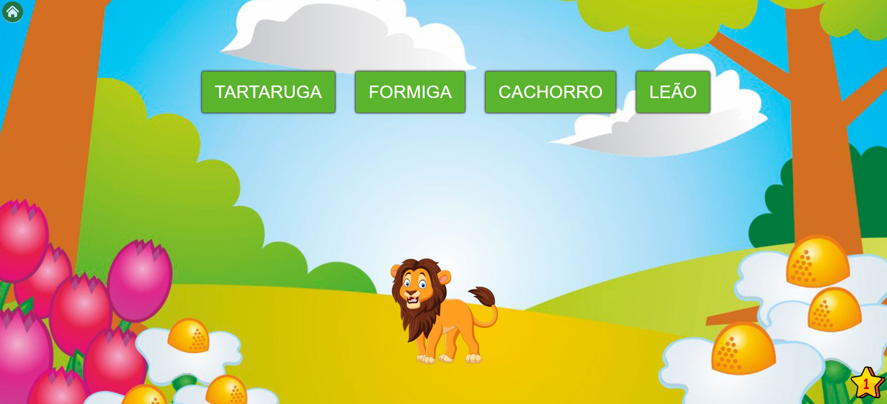

# 🐾 Animais - Projeto Pedagógico

Um projeto educacional completo para gerenciamento de informações sobre animais, construído com arquitetura de cliente-servidor moderna.

**Descrição do projeto:** Sistema interativo para cadastro, consulta e gerenciamento de dados de animais, desenvolvido como projeto pedagógico para demonstrar práticas de desenvolvimento full-stack.

---

## 📱 FRONTEND

**Localização:** [frontend/](frontend/)

**Descrição:** Interface web responsiva desenvolvida com AngularJS, oferecendo uma experiência interativa para manipular dados de animais.

**Stack Utilizado:**
- **AngularJS 1.8.3** - Framework JavaScript para aplicações web dinâmicas
- **Gulp 4** - Automação de tarefas e build do projeto
- **Karma + Jasmine** - Framework de testes unitários
- **BrowserSync** - Sincronização de navegadores durante desenvolvimento
- **Express.js** - Servidor local para desenvolvimento
- **HTML5/CSS3** - Estrutura e estilo da aplicação

**Como executar:**
```bash
cd frontend
npm install
gulp serve
```

---

## 🔧 BACKEND

**Localização:** [backend/](backend/)

**Descrição:** API RESTful robusta para gerenciamento de dados, desenvolvida com Spring Boot e PostgreSQL, fornecendo persistência de dados e lógica de negócio.

**Stack Utilizado:**
- **Spring Boot 2.7.6** - Framework Java para desenvolvimento rápido de aplicações
- **Spring Data JPA** - Camada de acesso a dados com ORM Hibernate
- **PostgreSQL** - Banco de dados relacional
- **Java 8** - Linguagem de programação
- **Maven** - Gerenciador de dependências e build
- **Jackson** - Serialização/desserialização JSON

**Como executar:**
```bash
cd backend
./mvnw spring-boot:run
```

---

## 🎯 GERAL

### Pré-requisitos
- Node.js e npm (para Frontend)
- Java 8+ (para Backend)
- PostgreSQL (para Banco de Dados)
- Docker e Docker Compose (opcional)

### Inicialização
- Antes de iniciar a aplicação, deve-se alimentar e configurar a base de dados com alguns animais de exemplo
- Configure as variáveis de ambiente e conexão com banco de dados
- Execute as migrações do banco de dados se houver

### Executar com Docker
```bash
cd backend
docker-compose up -d
```

---

## 📚 Stacks Utilizadas

| Camada | Tecnologia | Versão |
|--------|-----------|--------|
| Frontend | AngularJS | 1.8.3 |
| Frontend | Gulp | 4.0.2 |
| Frontend | Karma/Jasmine | 6.4.1 / 5.1.0 |
| Backend | Spring Boot | 2.7.6 |
| Backend | Java | 1.8 |
| Backend | PostgreSQL | - |
| Build | Maven | 3.8.1 |

---

## � Exemplos - Screenshots

### Tela Inicial



**Galeria de Exemplos:**

| Descrição | Arquivo |
|-----------|---------|
| Tela Inicial | [inicial.png](arquivos/inicial.png) |
| Menu com Letras | [letras.png](arquivos/letras.png) |
| Menu Administrativo | [menu_admin.png](arquivos/menu_admin.png) |
| Efeito de Sombra | [sombra.png](arquivos/sombra.png) |

---

## ✅ TODO - Roadmap de Modernização

- [ ] **Modernizar Frontend para React.js** - Migrar de AngularJS para React com Hooks e Context API
- [ ] Atualizar para Java 17+
- [ ] Implementar testes automatizados no Backend (JUnit 5)
- [ ] Adicionar autenticação e autorização (JWT/OAuth2)
- [ ] Criar documentação de API com Swagger/OpenAPI
- [ ] Implementar CI/CD pipeline
- [ ] Adicionar cobertura de testes no Frontend
- [ ] Containerizar a aplicação completamente
