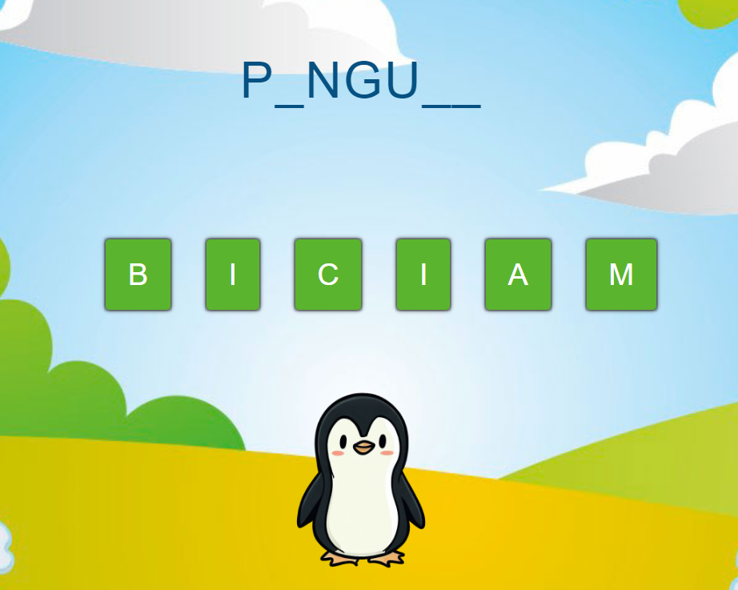
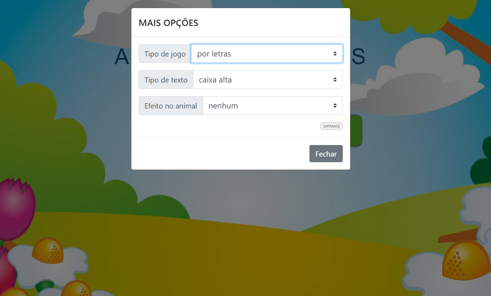
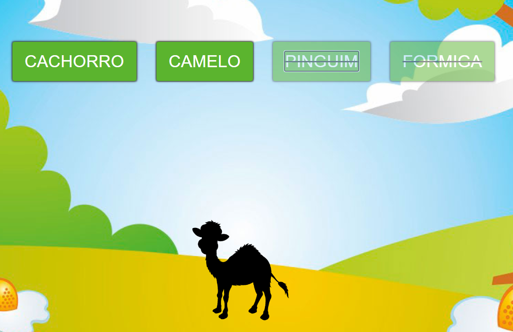

# 🐾 Animais


Projeto pessoal voltado ao ensino, desenvolvido para demonstrar práticas de desenvolvimento Full Stack utilizando Java, Spring Boot, PostgreSQL e AngularJS.

**Descrição do projeto:** Além da programação, tenho interesse por educação e desenvolvimento de ferramentas didáticas. Este projeto nasceu da união dessas duas áreas, utilizando uma aplicação Full Stack para criar um ambiente lúdico sobre animais, ao mesmo tempo em que demonstra práticas de desenvolvimento de software.

## 📂 Estrutura do Repositório

```text
.
├── .github/
│   └── images/              # Imagens utilizadas no README
├── backend/                 # API REST Spring Boot
├── frontend-angularjs/      # Aplicação AngularJS (atual)
├── frontend-react/          # Nova implementação em React
├── .gitignore
└── README.md
```

---


## 🔧 BACKEND

**Localização:** [backend/](backend/)

**Descrição:** API RESTful robusta para gerenciamento de dados, desenvolvida com Spring Boot e PostgreSQL, fornecendo persistência de dados e lógica de negócio.

**Stack Utilizado:**
- **Spring Boot 2.7.6** - Framework Java para desenvolvimento rápido de aplicações
- **Spring Data JPA** - Camada de acesso a dados com ORM Hibernate
- **PostgreSQL** - Banco de dados relacional
- **Java 8** - Linguagem de programação
- **Maven** - Gerenciador de dependências e build
- **Jackson** - Serialização/desserialização JSON

**Como executar:**
```bash
cd backend
./mvnw spring-boot:run
```

---

## 📱 FRONTEND ANGULARJS (Legado)

**Localização:** [frontend-angularjs/](frontend-angularjs/)

**Descrição:** Interface web responsiva desenvolvida com AngularJS, oferecendo uma experiência interativa para manipular dados de animais.

**Stack Utilizado:**
- **AngularJS 1.8.3** - Framework JavaScript para aplicações web dinâmicas
- **Gulp 4** - Automação de tarefas e build do projeto
- **Karma + Jasmine** - Framework de testes unitários
- **BrowserSync** - Sincronização de navegadores durante desenvolvimento
- **Express.js** - Servidor local para desenvolvimento
- **HTML5/CSS3** - Estrutura e estilo da aplicação

**Como executar:**
```bash
cd frontend-angularjs
npm install
gulp serve
```

---

## ⚛️ FRONTEND REACT (Em desenvolvimento)

**Localização:** [frontend-react/](frontend-react/)

**Descrição:** Nova implementação da interface utilizando React, criada para substituir gradualmente a versão em AngularJS, adotando uma arquitetura mais moderna e de fácil manutenção.

**Status:** 🚧 Em desenvolvimento


---


## 🎯 GERAL

### Pré-requisitos
- Node.js e npm (para Frontend)
- Java 8+ (para Backend)
- PostgreSQL (para Banco de Dados)
- Docker e Docker Compose (opcional)

### Inicialização
- Antes de iniciar a aplicação, deve-se alimentar e configurar a base de dados com alguns animais de exemplo
- Configure as variáveis de ambiente e conexão com banco de dados
- Execute as migrações do banco de dados se houver

### Executar com Docker
```bash
cd backend
docker-compose up -d
```

---

## 📚 Stacks Utilizadas

| Camada | Tecnologia | Versão |
|--------|-----------|--------|
| Frontend | AngularJS | 1.8.3 |
| Frontend | Gulp | 4.0.2 |
| Frontend | Karma/Jasmine | 6.4.1 / 5.1.0 |
| Backend | Spring Boot | 2.7.6 |
| Backend | Java | 1.8 |
| Backend | PostgreSQL | - |
| Build | Maven | 3.8.1 |

---

## 🖼️ Exemplos - ## 🖼️ Screenshots

### Tela Inicial


### Menu por Letras



### Menu Administrativo



### Efeito de Sombra



---

## ✅ TODO - Roadmap de Modernização

- [ ] **Modernizar Frontend para React.js** - Migrar de AngularJS para React com Hooks e Context API
- [ ] Atualizar para Java 17+
- [ ] Implementar testes automatizados no Backend (JUnit 5)
- [ ] Adicionar autenticação e autorização (JWT/OAuth2)
- [ ] Criar documentação de API com Swagger/OpenAPI
- [ ] Implementar CI/CD pipeline
- [ ] Adicionar cobertura de testes no Frontend
- [ ] Containerizar a aplicação completamente
